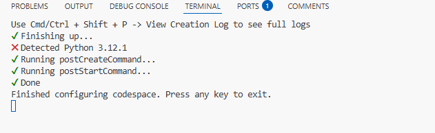
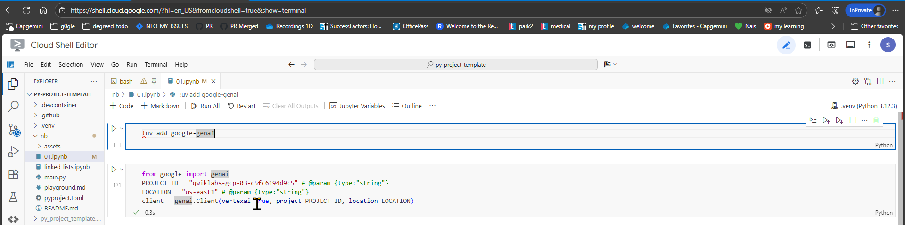
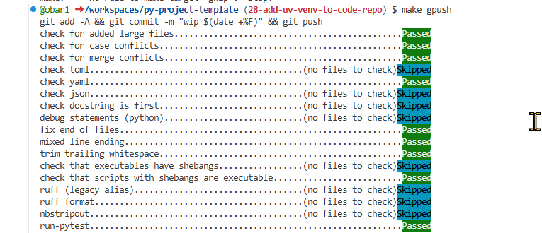

# pyproject-template

[](https://github.com/obar1/py-project-template/actions/workflows/makefile.yml)

simple py-project template
> class added just as placeholder for minimal test


## init
> init env and dependencies
```sh
make setup
```
`pre-commit`  will run check at each commit

> some devcontainer conf for auto setup in codespace



## check
> check the code
```sh
make check
```

## extra

### SET GCP
to auth in gcp project
[here](./set_gcp.sh)

```sh
chmod +x ./set_gcp.sh
./set_gcp.sh project_123
```

and if `you dare` you could this repo in a cloud shell and use it
> be careful, gcp is watching you




### NB PLAYGROUND
> do ` << 1 ` :)

```txt
    # NB PLAYGROUND

    > here some space to familiarize with the code

    ```bash
    pwd
    curl -LsSf https://astral.sh/uv/install.sh | sh

    # vsode
    mkdir -p .vscode
    cat > .vscode/settings.json <<'EOF'
    {
        "python.defaultInterpreterPath": ".venv/bin/python"
    }
    EOF
    rm -rf .venv
    export VIRTUAL_ENV="$(pwd)/.venv"

    uv venv .venv
    uv init
    uv add ipykernel

    touch 01.ipynb
    echo "restart vscode, if necessary"

    ```

    ## code and nb
    [here](./01.ipynb)

    ```
```

### GPUSH

> handy for draft prs
!!! squash and rebase when ready


